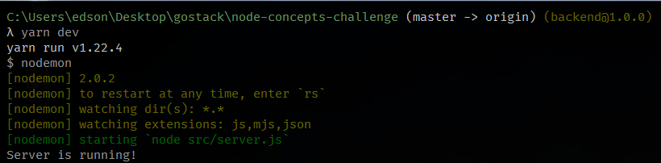

<h1 align="center">
 Conceitos do NodeJS
</h1>

<div align="center">
 "Ao infinito e além :rocket:"
</div>

## Sobre

Repositório criado para o Desafio de Conceitos do NodeJS, que consiste em criar uma API Rest (NodeJS + Express), utilizando rotas, middlewares, métodos e códigos de respostas HTTP, etc.

## Funcionalidades

Foi desenvolvida uma API Rest para repositórios, onde é possível listar, criar, alterar, deletar e dar likes em um determinado repositório.

## Endpoints

Rotas para cada ação/recurso:

| Método     | Rota                   | Ação                                                     |
| ------     | ---------------------- | -------------------------------------------------------- |
| **GET**    | /repositories          | Lista todos os repositórios existentes no back-end       |
| **POST**   | /repositories          | Cria um novo repositório no back-end                     |
| **PUT**    | /repositories/:id      | Altera um determinado repositório existente no back-end  |
| **DELETE** | /repositories/:id      | Deleta um determinado repositório existente no back-end  |
| **POST**   | /repositories/:id/like | "Curte" um determinado repositório existente no back-end |

**_Observações:_**
- Na rota **POST /repositories** (criar um novo repositório), os dados para a criação deste serão passados no Body Request (corpo da requisição), via JSON, da seguinte forma:
```json
{
	"title": "ReactJS",
	"url": "https://github.com/reactjs",
	"techs":[
		"Javascript",
		"ES6+"
	]
}
```
- Na rota **PUT /repositories/:id** (alterar um determinado repositório), **:id** deve ser substituído pelo identificador de um dado repositório. Após isso, os dados devem ser passados no corpo da requisição, assim como na rota de criação de um novo repositório.

- Na rota **DELETE /repositories/:id** (deletar um determinado repositório), **:id** também deve ser substituído pelo identificador de um dado repositório, assim como na rota de edição.

- Já a rota **POST /repositories/:id/like** (curtir um determinado repositório), **:id** também deve ser substituído pelo identificador de um dado repositório, assim como na edição e deleção. Esta rota consiste em dar um like (curtida) em um dado repositório, então todas as vezes em que chamada, incrementa o número de likes:
```json
{
  "id": "1c466d8ge-637d-738f-9a41-8392fb9cd28c",
	"title": "ReactJS",
	"url": "https://github.com/reactjs",
	"techs":[
		"Javascript",
		"ES6+"
	],
  "likes": 1
}
```

- Por último, um detalhe importante, tanto **POST** e **PUT** retornam um objeto JS, já **GET** retorna um array (coleção) de vários objetos.

## Requisitos

- [NodeJS](https://nodejs.org/en/)
- [Yarn](https://yarnpkg.com/)
- [Insomnia](https://insomnia.rest/download/) ou qualquer outra ferramenta para teste de API Rest

## Instalação

**Abra seu terminal e digite a sequência de comandos abaixo:**

- Faça um clone do projeto:
```
git clone https://github.com/edsssonrodrigues/Node-Concepts-Challenge.git
```

- Entre no diretório recém-clonado:
```
cd Node-Concepts-Challenge
```

- Baixe todas as dependências necessárias:
```
yarn
```

- Execute o projeto:
```
yarn dev
```

É esperado um retorno semelhante a este no seu terminal:




Se assim ocorrer, então deu tudo certo e sua API está funcionando perfeitamente! 
